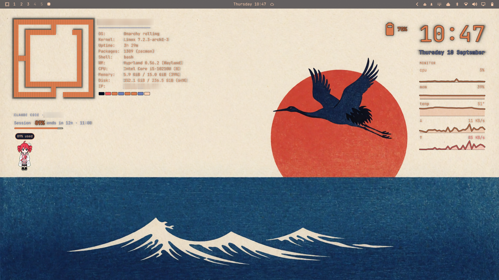
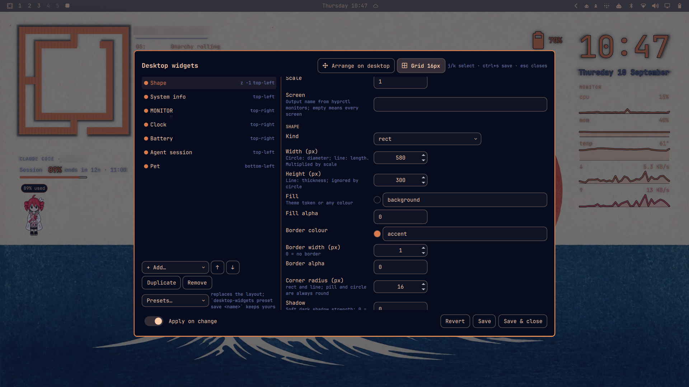
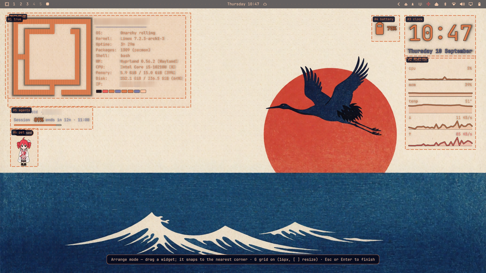
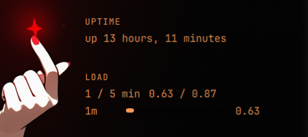

# Omarchy desktop widgets

Theme-aware widgets drawn on the wallpaper layer of Omarchy 4.x (Quattro):
a clock, system stats bars, and the output of any shell command. They sit
above the wallpaper and below every window, recolour with `omarchy theme set`,
and never touch Omarchy's own files.



## Install

Requires Omarchy 4.0.3 or newer (the Quattro shell). Three commands:
(Source of record: `https://github.com/EvivrusR/omarchy-tears`; the plugin id stays `homelab.desktop-widgets`.)

```bash
omarchy plugin add https://github.com/EvivrusR/omarchy-tears.git --yes
omarchy plugin enable homelab.desktop-widgets
~/.config/omarchy/plugins/homelab.desktop-widgets/bin/desktop-widgets install
```

`install` links the CLI into `~/.local/bin`, adds a *Desktop widgets* submenu to
the Omarchy menu, binds SUPER+ALT+W (editor) and SUPER+ALT+A (arrange), and
writes the example layout if you have no config. Every edit sits between
`desktop-widgets:begin/end` markers and `desktop-widgets uninstall` removes
exactly those again. Then `hyprctl reload` and press SUPER+ALT+W.

## Turn off, roll back, update

```bash
omarchy plugin disable homelab.desktop-widgets   # widgets vanish immediately
omarchy plugin enable  homelab.desktop-widgets   # and come back
omarchy plugin remove  homelab.desktop-widgets --yes
omarchy plugin update  homelab.desktop-widgets   # fast-forward pull with a diff preview
```

Disable and enable edit one entry in `plugins[]` of `~/.config/omarchy/shell.json`.
Nothing under `/usr/share/omarchy` is changed, so `omarchy update` and this plugin
cannot step on each other. If the plugin ever fails to compile, the shell logs
`service plugin load failed for homelab.desktop-widgets` and carries on without it.

## Configure

Edit `~/.config/omarchy/desktop-widgets.json`. It hot-reloads on save; a
malformed edit keeps the last good layout on screen and logs the parse error.
Comments (`//`, `/* */`) and trailing commas are allowed. Entries with invalid
values are skipped and the reason is logged (`journalctl --user _COMM=quickshell | grep desktop-widgets`);
unknown keys only warn. Every key's type, default and range comes from
`widgets/registry.json`.

```json
{
  "version": 1,
  "widgets": [
    { "type": "clock",   "corner": "top-right",    "x": 48, "y": 64,
      "timeFormat": "HH:mm", "dateFormat": "dddd d MMMM", "color": "accent" },
    { "type": "stats",   "corner": "bottom-left",  "x": 48, "y": 48,
      "show": ["cpu", "mem", "disk", "battery"], "intervalSec": 3, "backdrop": 0.35 },
    { "type": "command", "corner": "bottom-right", "x": 48, "y": 48,
      "title": "UPTIME", "command": "uptime -p", "intervalSec": 60, "maxLines": 4 },
    { "type": "agents", "corner": "top-left", "x": 48, "y": 64, "agent": "claude" }
  ]
}
```

Keys every widget accepts:

| key | default | meaning |
|---|---|---|
| `type` | required | `clock`, `stats`, `command`, `agents`, `template`, `shape`, `battery`, `sysinfo`, `monitor`, `weather`, `dock`, `pet`, or any drop-in |
| `corner` | `top-right` | `top-left`, `top-right`, `bottom-left`, `bottom-right`, `top-center`, `bottom-center` (centre ignores `x`) |
| `x`, `y` | 48 | offset from that corner, px |
| `z` | 0 | stacking: lower sits further back (−100..100); equal `z` keeps list order |
| `enabled` | true | `false` hides the widget without deleting it |
| `screen` | all | output name (`hyprctl monitors`) to draw on |
| `scale` | 1 | font and spacing multiplier |
| `backdrop` | 0 | alpha of a rounded themed card behind the widget |
| `color` | `foreground` | text colour: theme token (`foreground`, `background`, `accent`, `muted`, `urgent`) or any colour string |
| `mutedColor` | `muted` | secondary text colour, same forms |
| `outline` | `#000000` | crisp outline around all text, theme token or colour; `""` disables outline and halo |
| `halo` | 0.7 | strength (0..1) of the soft dark halo behind text, uses the outline colour |
| `align` | by corner | `left` or `right` text alignment |

Per type:

- **clock**: `timeFormat` (`HH:mm`), `dateFormat` (`dddd d MMMM`, empty string hides it). Qt date format strings.
- **stats**: `show` (any of `cpu`, `mem`, `disk`, `battery`), `intervalSec` (3), `diskPath` (`/`),
  `orientation` (`horizontal`; `vertical` stacks each bar under its label for a narrow column).
  Battery only appears when a `/sys/class/power_supply/BAT*` exists.
- **command**: `command` (run with `bash -lc`), `intervalSec` (60), `timeoutSec` (10), `maxLines` (8),
  `maxWidth` (420 px), `title`. A non-zero exit keeps the last good output and shows a red `!` by the title.
- **agents**: the current AI-agent session, same data as the shell's Agents bar widget. `agent` (`claude`;
  `codex` also works), `showWeekly` (false), `timeFormat` (`HH:mm`), `title`. Shows percent of the rolling
  session used, a meter, and `ends in 3h 31m · 23:59`. Display-only: it watches
  `~/.local/state/omarchy/agents/usage/<agent>.json`, which the bar widget refreshes every 15 minutes.
  If you disable the bar widget, set `refreshIntervalSec` (e.g. 900) so this widget triggers
  `omarchy-agent-usage-update --limits-only` itself.
- **battery**: glyph (`style`: `outline` icon-font battery, `pixel` `[████░]`, or `text`), percent, and time to
  empty or full from the battery's own power draw (`showPercent`, `showTime`, `warnAt` 20 turns it red,
  `intervalSec` 30). Hidden when the machine has no battery.
- **sysinfo**: a fastfetch-style block — logo or your own ASCII art beside a key/value table. `logo` is a
  dropdown of common fastfetch logos (`omarchy` default, `arch`, `linux`, `debian`, `ubuntu`, `fedora`, `nixos`, …),
  `none`, or `custom`, which reveals `logoName` (any name from `fastfetch --list-logos`), `art` (paste your own
  ASCII art in the editor's multi-line box; from the CLI `--set art="line1\nline2"`) and `artFile` (a text file);
  pasted art wins over the file, which wins over the name. `logoPosition` (`left`/`above`), `logoColor` (`accent`), `fields`
  (any of os, host, kernel, uptime, packages, shell, wm, cpu, gpu, memory, disk, ip, battery), `title`
  (user@host + rule), `swatches` (theme colour row), `intervalSec` 60. Needs `fastfetch` on PATH (Omarchy ships it).
- **monitor**: stats over time. `rows` (any of cpu, mem, gpu, temp, load, net-down, net-up), polled every
  `intervalSec` (10) and kept for `windowSec` (300), drawn as `graph`: `sparkline` (filled, right edge = now),
  `bars`, or `none`; `graphWidth` 200 / `graphHeight` 28 px; `iface` (empty = default route); `title`;
  `downColor` (`accent`) / `upColor` (`urgent`). GPU is best effort: NVIDIA via `nvidia-smi`, AMD via sysfs,
  otherwise `n/a`. The `ops` preset shows all three of these together.
- **weather**: current conditions and the next hours for a place you type — `place` (`Tokyo, Japan`;
  "City, Country", resolved once through Open-Meteo's free geocoder and cached; **never** your IP or
  location), `units` (`metric`/`imperial`), `refreshMin` 15, `layout` (`stacked`/`inline`), `show` (place,
  feels, humidity, wind, hours, attribution), `hours` 6. Weather data by Open-Meteo.com (CC BY 4.0); the
  attribution row is on by default. Offline, the last forecast is shown and marked.
  **Effect**: `effect: true` adds a second, full-screen window with animated ASCII weather — stars or a
  sun when clear, drifting clouds, fog, drizzle, rain (slanted when windy), swaying snow, and storm flashes.
  `effectPlacement`: `back` (default, behind every widget), `front` (above them all), or `custom` (uses the
  widget's `z`, shown in the editor only then; the effect sits just above its own widget at equal z).
  `effectOpacity` 0.4 (multiplied by each effect's own preset opacity, so rain is never a wall), `effectDensity` 1,
  `effectFps` 6, `effectColor` (`foreground`). The animation timer only runs while something moves.
- **dock**: a row of app icons that launch on click — the one widget that takes pointer input. It lives on the
  wallpaper like everything else, so it is clickable wherever no window covers it and never reserves space.
  `apps` (desktop-entry ids in order; `desktop-widgets apps` lists them, the editor has a searchable picker fed by
  the same entries as Omarchy's Apps menu), `iconStyle`, bar-wide (`themed` tints every icon in the widget's text colour so
  any icon set matches the theme; `mono` decolourises them to greys; `original` keeps the real icons), `iconSize` 32, `spacing` 8, `labels` (names
  under icons; otherwise a hover tooltip), `hoverScale` 1.2. Defaults to `bottom-center`, `y: 8`, `backdrop: 0.5`.
  Launches through `uwsm-app -- gtk-launch <id>.desktop`, the way Omarchy's menu does.
- **pet**: an animated sprite that reacts to something you choose. Uses the **Hermes / petdex sprite-sheet
  contract** (`spritesheet.webp`, 192×208 cells, 8 columns, one row per state: idle, running, waving,
  jumping, failed, waiting, review), so any pet from [petdex.dev](https://petdex.dev) or one hatched in
  [Hermes Agent](https://github.com/NousResearch/hermes-agent) with `/hatch` drops straight in — put it under
  `~/.config/omarchy/desktop-widgets.pets/<name>/`, or point `sheet` at `~/.hermes/pets/<slug>/spritesheet.webp`;
  `desktop-widgets pets` lists every sheet on the machine and the plugin ships `examples/pets/hermes-girl`.
  `watch` picks a ready-made rule set: `claude` (session %, agents at work, reset), `battery`, `agents`, `cpu`,
  `mem`, `gpu`, or `custom` with your own `rules` (rows of `when`/`on`: a test over the signals, the state to
  show, an optional `beat` in seconds for `on`, and a `say` bubble text with `{signal}` placeholders). Add one
  pet per thing you care about. `size` (96 px, any value), `fps` 6, `bubble`, `flip`, `intervalSec` 5. The
  sprite carries no logic; the rules do, and a blank trailing frame in a row is trimmed the way Hermes does.
  **Layers**: `layers` rows add props and outfits drawn with the body — `image` (a static PNG/SVG such as
  the shipped `examples/pets/props/rug.png` and `stool.png`; `z` back/front, `x`/`y` offset in cell px, `scale`)
  or `sheet` (another sprite sheet in the same atlas, clipped to the body's current row and frame so it never
  drifts; `follow` names the row to use when it lacks one). The pet's window grows to fit its layers.
  **Links**: every pet publishes `pets.<name>.state`, `.say` and `.watch` for the others' rules, so
  `{"kind":"when","if":"pets.jill.state == 'failed'","state":"waiting","say":"jill?!"}` makes one pet react to
  another (they read the previous tick, so nobody waits on anybody). `name` defaults to the sheet's folder.
  **Make your own without an image model**: `examples/pets/hanna/generate.py` draws a chibi pet procedurally
  (pycairo + ImageMagick, pixel look, all nine rows) and a matching outfit sheet on a transparent body
  (`examples/pets/hanna-jacket`) — copy it, change the colours and poses, run it, and you have a pet plus
  swappable outfits that stay in lock-step.
  **Looks**: a look is a sheet row with at least one drawn cell; `desktop-widgets pets --looks` and the editor
  (under the sheet field) show which looks a sheet has and how many frames each has. A rule that names a look the
  sheet lacks falls back: jumping → waving, waiting → review, failed → waiting, then idle.
  **Rules without expressions**: with `watch: custom` the `rules` rows can be `range` (`signal`, `min`/`max`;
  `min > max` wraps, so `hour` 23→6 is night), `flag` (`signal`, `is`), `keyword` (`signal`, comma-separated
  `words`, `match` any|all|none — case-insensitive substrings via `~`), `pet` (`pet`, `look`, `then`), or raw
  `when`/`on`. Every row takes `look` (`then` for pet rows), `say`, `beat` (seconds; makes it a one-shot) and
  `and` (an extra raw test). Top-down, first steady match wins. **Customise these rules** in the editor (or
  `desktop-widgets pet expand N`) copies the preset you were watching into editable rows. `desktop-widgets pet
  check` lists rule problems; the editor shows them under the rows. Extra text/number signals: `signals` rows
  (`key`, `command`) become `custom.<key>` — e.g. the focused window title for a keyword rule. One `dw-signals`
  sampler serves every pet. Rules that read another pet see its latest published state, at most one tick old, so
  a chain of three pets reacts across three intervals. Two pets on the same sheet folder publish as `teto` and
  `teto_2` (set `name` to choose).
  **petdex**: paste a `https://petdex.dev/pets/<slug>` URL into the editor's *Get a pet* box and press Download,
  or `desktop-widgets pet fetch <url|slug> [--add | --widget N]`. The installer script is parsed as a manifest
  (never run), assets must come from `assets.petdex.dev`, the sheet is validated, and provenance is stored in
  `pet.json` (`source.site/url/fetchedAt/license`; shown by `desktop-widgets pets`). The licence label is read
  only from the pet page's JSON-LD `license` field — petdex pages currently publish none, so it shows `unknown`
  rather than a guessed label. Art stays under `~/.config/omarchy/desktop-widgets.pets/<slug>/`, never in the plugin.
- **shape**: pure form, no text — a translucent panel, divider, pill or circle to lay *behind* other
  widgets (give it a lower `z`). `kind` (`rect`, `pill`, `circle`, `line`), `width` (320) and `height` (200)
  in px before `scale` (circle uses `width` as its diameter; line uses `height` as its thickness),
  `fill` (`background`) + `alpha` (0.4), `border` (`accent`) + `borderWidth` (0 = none) + `borderAlpha` (1),
  `radius` (12, rect/line only), `shadow` (0..1, soft dark drop shadow; when on, the widget's box grows by
  24·scale px on every side so the shadow has room, and `x`/`y` place that box). Text keys (`color`,
  `outline`, `halo`, `align`, `backdrop`) do not apply and warn if set. Shapes never take input.

  ```json
  { "type": "shape", "corner": "top-left", "x": 24, "y": 36, "z": -1,
    "width": 320, "height": 232, "fill": "background", "alpha": 0.45, "borderWidth": 1, "borderAlpha": 0.5 }
  ```

## Editor panel

A native Omarchy panel edits the same file: list on the left, a form generated
from `widgets/registry.json` on the right, the desktop updating as you edit.



```bash
desktop-widgets editor                                   # toggle it
omarchy-shell shell toggle homelab.desktop-widgets '{}'  # what that runs
```

- **Add** picks a type; **Duplicate**, **Remove**, **↑/↓** act on the selected row; the dot toggles `enabled`.
- **Apply on change** (default on) saves after every edit through `desktop-widgets write`, so an invalid value is refused with its reason in the footer and the file is left alone. Off, edits wait for **Save**; **Revert** reloads the file; Esc asks before discarding.
- Values equal to the registry default are dropped from the file, so it stays minimal.
- Keys: `j`/`k` select, Tab moves through fields, Ctrl+S saves, Ctrl+Shift+S saves and closes, Esc closes (or leaves a text field).
- A successful save is confirmed in the status line (`✓ Saved HH:MM:SS — N widgets written…`, highlighted for a moment) and the Save button reads *Saved ✓*; **Save & close** writes if needed and closes the panel.
- If the file has comments the panel starts with apply-on-change off and warns that saving from it drops them.
- Scriptable: `omarchy-shell shell call homelab.desktop-widgets call '{"op":"add","type":"clock"}'`
  (ops: `select{index}`, `add{type}`, `remove`, `duplicate`, `move{dir}`, `set{key,value}`, `toggleEnabled{index}`, `save`, `revert`, `applyOnChange{value}`, `state`).

Menu: Style › *Desktop widgets* › **Editor** (`desktop-widgets install --menu-parent <id>` puts the rows under another submenu, `''` for top level). `desktop-widgets install` adds the SUPER+ALT+W / SUPER+ALT+A binds; SUPER+SHIFT+W is Omawrite on a stock Omarchy, which is why ALT.

## Arrange mode (drag-to-place)

Off by default and impossible to trigger by accident: widget windows have an
empty input region, so nothing on the desktop is draggable until you arm it.



Arm it from the editor's **Arrange on desktop** button, **SUPER+ALT+A**,
the menu's *Desktop widgets › Arrange* row, or `desktop-widgets arrange on`. Every
widget gets a dashed frame; drag one and it follows live, snaps to the nearest
corner on release, and saves `corner`/`x`/`y` through `desktop-widgets write`.
Esc or Enter finishes; it also disarms itself after a minute idle and never
survives a shell restart.

Scriptable (same path as the mouse): `omarchy-shell desktop-widgets drag <index> <dx> <dy>`,
`omarchy-shell desktop-widgets arrange on|off|toggle`, `omarchy-shell desktop-widgets state`.

**Optional bar companion.** The plugin also ships a bar widget that shows 󰆾
only while arrange mode is armed (click finishes, right-click opens the
editor). Add it by putting `{ "id": "homelab.desktop-widgets" }` into a bar
section of `~/.config/omarchy/shell.json` (hot-reloads); leave it out if you
don't want it. Omarchy 4.0.3's `omarchy plugin enable … right` / `omarchy bar put`
do not place it because the plugin is already listed under `plugins[]` for its
service — a known quirk of mixed-kind plugins.

### Grid snapping

Off by default. `desktop-widgets grid on|off|<px>` (4..256, default 24) or the **Grid**
button in the editor (click toggles, right-click doubles, middle-click halves). While
arrange mode is armed, `G` toggles it and `[` / `]` resize it; the grid shows as dots.
Snapping applies to the offsets from the chosen corner, so `x: 48` stays 48 on a
24-grid and existing layouts never drift. Stored at the top of the config:

```json
{ "version": 1, "grid": { "enabled": true, "size": 24 }, "widgets": [ … ] }
```

Top-level keys other than `widgets` are settings; every writer (CLI, editor, presets)
carries them over, and presets never contain them.

## Presets (whole-screen layouts)

A preset is a complete `widgets[]` layout you apply in one go. Four ship with the
plugin — `minimal` (one big clock), `dashboard` (the example layout on a panel),
`column` (a narrow left column: panel, small clock, vertical stats, Claude session) and
`ops` (system-info block on a panel, monitor sparklines, battery, clock) —
and you keep your own under `~/.config/omarchy/desktop-widgets.presets/<name>.jsonc`
(same format as the config, plus an optional `"description"`; a preset of yours with
a shipped name wins).

```bash
desktop-widgets preset save mine            # keep what's on screen now
desktop-widgets preset apply column         # try another layout (previous one is in .bak)
desktop-widgets preset apply mine           # and back
```

The editor has a **Presets…** dropdown (disabled while you have unsaved edits); it
applies through the same CLI path and the panel follows the file.

## Template widgets (no code)

Any command that prints JSON becomes a widget: describe rows in the config and
use `{placeholders}` from the output.



```jsonc
{ "type": "template", "corner": "bottom-right", "intervalSec": 10,
  "command": "python3 -c 'import json,os; l=os.getloadavg(); print(json.dumps({\"l1\":l[0],\"l5\":l[1],\"cpus\":os.cpu_count()}))'",
  "rows": [
    { "kind": "heading", "text": "LOAD" },
    { "kind": "kv",  "label": "1 / 5 min", "value": "{l1|fixed:2} / {l5|fixed:2}" },
    { "kind": "bar", "label": "1m", "value": "{l1}", "text": "{l1|fixed:2}", "max": "{cpus}", "warnAt": 0.9 }
  ] }
```

| kind | keys |
|---|---|
| `heading` | `text` |
| `text` | `text` |
| `kv` | `label`, `value`, `labelWidth` |
| `bar` | `label`, `value` (number for the meter), `text` (display, defaults to value), `min` (0), `max` (100), `warnAt` (0.9 → red), `suffix`, `labelWidth` |
| `spacer` | `height` (px) |

Placeholders: `{path}` with dotted paths and indices (`{disks.0.pct}`), filters
`{v|fixed:2}` `{v|round}` `{v|int}` `{v|pct}` `{v|upper}` `{v|lower}` `{v|human}`
(1234567 → 1.2M) `{v|secs}` (3725 → 1h 02m) `{v|default:none}`. Missing values
show `—`; literal braces are `{{` `}}`. Output that isn't a JSON object is still
available as `{output}` and `{lines.N}`. A failing command keeps the last values
and marks the heading with a red `!`.

The editor renders template rows as an inline list (kind dropdown, the kind's
keys, reorder, remove, `+ row`).

## Drop-in widget types (your own QML, no fork)

Add a widget *type* by dropping a folder under `~/.config/omarchy/desktop-widgets.d/<name>/`:

```
desktop-widgets.d/hello/
├── type.json     # its fields, registry-style (common keys are added for you)
└── Widget.qml    # the same contract the built-in widgets use
```

```bash
desktop-widgets new hello          # scaffolds both files from examples/drop-in/hello
desktop-widgets types              # lists it as "Hello (drop-in)"; reports broken drop-ins
desktop-widgets add hello --set name=sir
```

`Widget.qml` is a `WidgetCard { ... }` like `widgets/ClockWidget.qml`. It gets the
plugin's kit through a relative import that is identical on every install:

```qml
import "../../plugins/homelab.desktop-widgets/widgets"   // WidgetCard, WidgetText, …
WidgetCard {
  id: root
  readonly property string name: String(config.name || "world")   // your type.json fields, defaults applied
  Column { WidgetText { outlineColor: root.outlineColor; halo: root.halo; text: "hello, " + root.name; color: root.textColor } }
}
```

`type.json`:

```json
{ "displayName": "Hello", "description": "A greeting.",
  "fields": [ { "key": "name", "type": "string", "label": "Name", "default": "world" } ] }
```

Field types are the registry's (`string`, `integer`, `number`, `boolean`, `enum`, `multi-enum`,
`color`, `path`, `command`, `rows`), so the CLI validates your keys and the editor
generates a form for them automatically. Names must match `^[a-z][a-z0-9-]{0,39}$` and
cannot shadow a built-in type. A broken drop-in is reported and skipped, never fatal.

A **new** drop-in shows up as soon as you add a widget of that type; **editing** an
existing drop-in's QML needs `omarchy restart shell` (the shell caches compiled QML).
`omarchy-shell desktop-widgets rescan` re-reads the registry by hand.

## CLI

`bin/desktop-widgets` (Python 3, no dependencies) edits and checks the config for you.
Put it on your PATH once:

```bash
mkdir -p ~/.local/bin && ln -sf ~/.config/omarchy/plugins/homelab.desktop-widgets/bin/desktop-widgets ~/.local/bin/desktop-widgets
desktop-widgets status
```

| command | what it does |
|---|---|
| `list` | index, type, on/off, corner, offsets, one-line summary per widget |
| `types [type]` | every widget type (built-in and drop-in), or one type's keys with type, default, range and description |
| `registry [--json]` | the merged registry; `--json` is what the service consumes |
| `new <name> [--force]` | scaffold a drop-in widget type under `~/.config/omarchy/desktop-widgets.d/` |
| `validate [file]` | check the config; exit 1 with per-widget messages on errors |
| `add <type> [--corner C] [--x N] [--y N] [--set key=value ...]` | append a widget |
| `set <index> key=value ...` | change values; typed by the registry (`show=cpu,mem`, `enabled=false`, `scale=1.5`) |
| `move <index> [--corner C] [--x N] [--y N]` | reposition |
| `enable <index>` / `disable <index>` | keep the widget in the file but hide it |
| `remove <index>` / `duplicate <index>` | delete, or copy into the next slot |
| `apps [--json] [--all]` | desktop entries a dock can show (id + name) |
| `pets [--json]` | sprite sheets a pet can use (plugin examples, `~/.config/omarchy/desktop-widgets.pets`, Hermes pets and profiles); columns include licence/source |
| `pets --looks [slug]` | which looks each sheet has and how many frames (Pillow or ImageMagick `magick` measures pixels; otherwise geometry-only, noted) |
| `pet expand <index>` | copy the preset rules a pet is watching into editable `rules` rows and set `watch: custom` |
| `pet check [index] [--json]` | list rule problems for one pet or all pets (unknown signal, bad expression, look not on this sheet, min ≥ max…) |
| `pet fetch <url\|slug> [--add \| --widget N] [--force] [--json]` | download a pet from petdex.dev into `~/.config/omarchy/desktop-widgets.pets/<slug>/`, optionally wiring it into the config; exit codes: 0 ok, 2 not a petdex URL, 3 not found, 4 network, 5 invalid pet, 6 exists |
| `grid [on\|off\|toggle\|<px>]` | show or set arrange-mode grid snapping |
| `preset list [--json]` / `show <name>` | whole-screen layouts: shipped (`presets/` in the plugin) and yours (`~/.config/omarchy/desktop-widgets.presets/<name>.jsonc`, which shadow shipped names) |
| `preset apply <name>` | replace the whole layout with a preset (validated, previous layout in `.bak`) |
| `preset save <name> [--force] [--description …]` / `remove <name>` | keep the current layout as a preset of yours / delete one of yours |
| `edit` | open in `$VISUAL`/`$EDITOR`, validate on save, keep `.bak`; comments survive |
| `status [--enabled]` | plugin enabled?, config health, windows on screen, last log lines; `--enabled` is a plain exit code for scripts |
| `toggle` | `omarchy plugin enable`/`disable` the plugin |
| `arrange [on\|off\|toggle]` | arm/disarm drag-to-place (asks the running shell) |
| `editor` | open or close the editor panel (`omarchy-shell shell toggle homelab.desktop-widgets`) |
| `write` | replace the whole config with a JSON document read from stdin; validated, `.bak` kept (the editor panel's write path) |
| `install` / `uninstall [--purge]` | link the CLI, add/remove menu rows and keybinds (marker blocks), write the example layout |
| `init [--force]` | write the example layout as your config |
| `path` | print the config path |

Every write is atomic and leaves the previous file at `desktop-widgets.json.bak`.
Mutating commands write plain JSON, so they refuse to touch a file that contains
comments unless you pass `--force` (use `edit` to keep comments). A write that
would produce an invalid config is refused with the reasons.

## Omarchy menu

`desktop-widgets install` writes these rows under Omarchy's own **Style** submenu
(`~/.config/omarchy/extensions/omarchy-menu.jsonc`, hot-reloads) — Style exists on
every install, so nothing needs to be created first. Absolute paths via `$HOME`
because the shell's environment need not include `~/.local/bin`.

```jsonc
"style.widgets":         {"icon":"󱂬","label":"Desktop widgets","aliases":["widgets"],"description":"Wallpaper-layer widgets"},
"style.widgets.editor":  {"icon":"󰏫","label":"Editor","action":"omarchy-shell shell toggle homelab.desktop-widgets '{}'"},
"style.widgets.edit":    {"icon":"","label":"Edit config","action":"omarchy-launch-terminal $HOME/.config/omarchy/plugins/homelab.desktop-widgets/bin/desktop-widgets edit"},
"style.widgets.status":  {"icon":"󰋼","label":"Status","action":"omarchy-launch-floating-terminal-with-presentation \"$HOME/.config/omarchy/plugins/homelab.desktop-widgets/bin/desktop-widgets status; read -n1 -s -r -p 'press any key'\""},
"style.widgets.enabled": {"icon":"󰔡","label":"Enabled","checked":"$HOME/.config/omarchy/plugins/homelab.desktop-widgets/bin/desktop-widgets status --enabled","action":"$HOME/.config/omarchy/plugins/homelab.desktop-widgets/bin/desktop-widgets toggle"},
"style.widgets.restart": {"icon":"","label":"Restart shell","action":"omarchy-restart-shell"},
```

`--menu-parent household` (or any submenu id, `''` for top level) puts them elsewhere; an existing `*.widgets` submenu is left alone.

## Developing

Work happens on branches (`feat/<name>`), merged to `master` when ready; `master` is what `omarchy plugin update` pulls, so it must always run. Push both remotes: `git push origin <branch> && git push github <branch>`.

Code lives in the plugin directory as a git checkout. Config changes hot-reload.
**Code** changes need `omarchy restart shell`: the shell's plugin reload only
watches the top level of the plugin directory and keeps already-compiled QML
under `widgets/` cached, so a disable/enable or a rescan is not enough.

```bash
node --test tests/*.test.js              # pure-JS parsing and formatting
omarchy plugin validate .                # manifest schema
journalctl --user _COMM=quickshell -f | grep desktop-widgets
hyprctl layers | grep homelab-desktop-widgets
```

Design notes: `docs/superpowers/specs/2026-09-09-desktop-widgets-design.md`. Where this is going (registry, CLI, native editor, drop-in widget types): `docs/ROADMAP.md`.
