# Desktop widgets

Wallpaper-layer widgets for Omarchy 4.x, configured from one file and driven by one CLI.
Everything you need is on the machine: the plugin checkout is
`~/.config/omarchy/plugins/homelab.desktop-widgets/` (README, `docs/ROADMAP.md`,
`docs/superpowers/{specs,plans}/`), the CLI is `desktop-widgets` on PATH.

**Core rule: the config has one writer.** Change `~/.config/omarchy/desktop-widgets.json`
through `desktop-widgets` (or the editor, which calls the same `write`). Every write is
validated against the registry and keeps `.bak`. Never edit the file with sed/python; never
write it from QML.

## Pick the path first

```dot
digraph path {
  "What is being asked?" [shape=diamond];
  "Place, tune, enable, restyle an existing widget kind" [shape=box];
  "Show a command's JSON as text/kv/bar rows" [shape=box];
  "New look, colours per state, timers, custom drawing" [shape=box];
  "Use a widget kind someone else published" [shape=box];
  "Change how every widget/type/editor/CLI works" [shape=box];
  "`ext add <git url>` then `add <name>` (no code)" [shape=box];
  "CLI: add/set/move/preset" [shape=box];
  "`template` widget (no code)" [shape=box];
  "Drop-in type under desktop-widgets.d/ (no fork)" [shape=box];
  "Core change: read contributing.md, feat/ branch" [shape=box];
  "What is being asked?" -> "Place, tune, enable, restyle an existing widget kind" -> "CLI: add/set/move/preset";
  "What is being asked?" -> "Show a command's JSON as text/kv/bar rows" -> "`template` widget (no code)";
  "What is being asked?" -> "New look, colours per state, timers, custom drawing" -> "Drop-in type under desktop-widgets.d/ (no fork)";
  "What is being asked?" -> "Use a widget kind someone else published" -> "`ext add <git url>` then `add <name>` (no code)";
  "What is being asked?" -> "Change how every widget/type/editor/CLI works" -> "Core change: read contributing.md, feat/ branch";
}
```



A personal or site-specific widget (one machine's API, one person's tracker) is a drop-in or
a template, not a core type. Core changes are for behaviour every user needs.

## Quick reference

Read before deciding — three commands answer most questions, no source reading needed:

```bash
desktop-widgets list                 # index, type, corner, offsets, summary (indices drive every other command)
desktop-widgets types [type]         # first line `kit api N`, then every type; or one type's keys with type/default/range — the registry, authoritative
desktop-widgets status               # plugin enabled?, config health, windows on screen, last log lines
```

| task | do |
|---|---|
| add a widget | `desktop-widgets add <type> --corner bottom-right --x 48 --y 48 --set key=value --set key2=value2` (one `--set` per pair) |
| change values | `desktop-widgets set <index> key=value key2=value2` — commas split only `multi-enum`/`apps` keys (`show=cpu,mem`); strings keep them (`place='Melbourne, Australia'`) |
| move / hide / delete | `move <index> --corner C --x N --y N` · `disable`/`enable <index>` · `remove <index>` |
| whole layouts | `preset list` · `preset apply <name>` (old layout in `.bak`) · `preset save <name>` |
| pets | `pets [--looks]` · `pet expand <index>` (preset rules → editable rows) · `pet check` · `pet fetch <petdex url>` |
| new type without code | `add template --set command='…' ` then rows; see README "Template widgets" for kinds + filters |
| new type with QML | `desktop-widgets new <name>` scaffolds the hello example into `~/.config/omarchy/desktop-widgets.d/<name>/{type.json,Widget.qml}`; overwrite both **before** the first `add <name>` — the `add` compiles it, **no shell restart**; only a QML edit *after* that first add needs `omarchy restart shell`; contract in [kit.md](kit.md) |
| install a drop-in someone shares | `desktop-widgets ext add <git url> [name]` (clones into `desktop-widgets.d/<name>/`, validates, prints the fields; exit 2 usage, 4 git, 5 invalid, 6 exists) then `add <name>`; `ext list [--json]` · `ext update [name]` · `ext remove <name>` (refuses while widgets use it; `--force` removes them through the one writer). Say that a clone runs its `Widget.qml` on the desktop — read it first |
| share a drop-in | the folder *is* the repo: `type.json` (with `"requires": {"api": 1}`) + `Widget.qml` at the root, README optional; push it, others `ext add` it |
| open the editor | `desktop-widgets editor`; scripted: `omarchy-shell shell call homelab.desktop-widgets call '{"op":"state"}'` (ops in README "Editor panel"; the panel must have been opened once) |
| drag placement | `desktop-widgets arrange on` (SUPER+ALT+A); `grid on|<px>` for snapping |

Corners: `top-left top-right bottom-left bottom-right top-center bottom-center` (centre ignores `x`).
The user's words rarely match a type name: "system stats" may be `stats`, `monitor` (graphs) or
`sysinfo` (fastfetch block) — match against `list` first, `types` second, and say which you picked.
Colours are theme tokens (`foreground background accent muted urgent`) or any colour string;
prefer tokens so the widget recolours with `omarchy theme set`. Common keys on every type:
`corner x y z enabled screen scale backdrop color mutedColor outline halo align`.

## The seam: kit api and `requires`

The contract a drop-in is written against has a version. **Today it is `api 1`** (`desktop-widgets
types` prints it first; `status` has an `api:` row; `registry --json` carries `"api"`). It covers
exactly what `tests/fixtures/kit/api-1.json` lists: the `WidgetCard` / `WidgetText` / `Sparkline`
properties and functions in [kit.md](kit.md), the relative import path, the type.json field types,
and the injected `config` / `service`. The number moves only on a breaking change to that list;
adding is not breaking.

- A drop-in pins it with `"requires": {"api": 1}` in `type.json` (`new` scaffolds it). Leave it
  out for a private drop-in, keep it for anything shared.
- A mismatch is a **warning, not a skip**: `WARN drop-in x wants api 2, plugin provides 1` on
  stderr from `types`/`validate`/`registry`/`ext add`, and `drop-in warning: …` in the journal.
  The widget still loads; if its QML then fails to compile it is skipped like any other broken
  drop-in. A malformed `requires` (not `{"api": <positive int>}`) is a problem and the drop-in is
  skipped.
- Changing the plugin so that something in the fixture disappears fails `tests/kit.test.js` and
  the `Kit` class in `tests/test_cli.py` until `api` is bumped in `widgets/registry.json` and
  `api-<n+1>.json` is added — rule 2b in [contributing.md](contributing.md). Never bump it for
  an addition.

## When does a change take effect?

Restart the shell in exactly one case: QML that the shell has **already compiled** changed.

| change | needs |
|---|---|
| config (`add`/`set`/editor/hand edit) | nothing — the service watches the file |
| a **new** drop-in folder (hand-made or `ext add`), then `add <name>` | nothing — the `add` compiles it; do not restart |
| `ext update` pulled new QML for a drop-in that is on screen | `omarchy restart shell` (the command says so when it applies) |
| editing a drop-in's `Widget.qml` that is already on screen, or any file in the plugin dir | `omarchy restart shell` (compiled QML is cached; disable/enable and `rescan` are not enough) |

Verify after a change: `desktop-widgets status` (window count, no skipped widgets) and
`journalctl --user _COMM=quickshell -n 40 | grep desktop-widgets` (no `skipped`, `parse error`,
`drop-in problem`, `failed to load`). A widget with an invalid value is skipped with a reason
there; an unknown key only warns; a `drop-in warning:` line is an api mismatch, not a failure.

## Never

- Write `desktop-widgets.json` by hand from a script; bypass `write`.
- Touch anything under `/usr/share/omarchy/` (reading is fine).
- Make arrange mode always-on or give widgets an input region (only `dock` takes input, by declaring `input: true`).
- Hard-code `#hex` theme colours, `$HOME` paths or one machine's hostnames into core files.
- Spend money or network on a user's behalf without saying so (`pet fetch` and `ext add`/`ext update` download; a weather widget geocodes its place once when the shell loads it and then polls Open-Meteo; `command`/`template`/drop-in widgets run whatever they are given; nothing else phones out).

## Extending and contributing

- Drop-in widget contract, kit properties, fetch/timer pattern, testing a state you cannot
  trigger live: [kit.md](kit.md).
- Changing the plugin itself (registry first, both test suites, restart rule, branch + push
  rules, PR checklist): [contributing.md](contributing.md).
